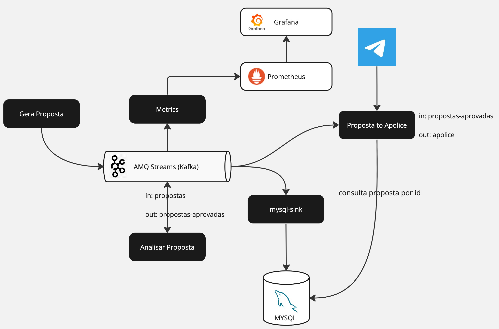

= EDA Hackathon

Cenário Geral



== Gerador Proposta

    mvn compile quarkus:dev

=== Deploy on Openshift

    cd generator/camel-generator
    sh deploy-on-kub.sh

== Metrics 

    mvn compile quarkus:dev

=== Deploy on Openshift

    cd generator/camel-generator
    sh deploy-on-kub.sh

== Analisar Proposta

    oc create secret generic analisar-proposta --from-file application.properties

    kamel run -t prometheus.enabled=true -t telemetry.enabled=true AnalisarProposta.java -d camel:jq --label app-with-metrics=quarkus-app  --config secret:analisar-proposta

== Proposta to Apolice

    oc create secret generic proposta-to-apolice --from-file application.properties

    kamel run -t prometheus.enabled=true -t telemetry.enabled=true PropostaToApolice.java --label app-with-metrics=quarkus-app --dev --config secret:proposta-to-apolice

== Connecting locally into Openshift databases

    oc port-forward <mysql-pod> 3306:3306

So use your favorite SQL browser to dig into the data.


== Install

All the proof of concept it's inside Openshift.

NOTE: I decided to remove Operators logic from the playbooks because it looks to broke whenever there is a new version of a Operator the playbooks starts to fail (It's annoying).

=== Parameters

[options="header"]
|=======================
| Parameter      | Example Value                                      | Definition
| tkn     | sha256~vFanQbthlPKfsaldJT3bdLXIyEkd7ypO_XPygY1DNtQ | access token for a user with cluster-admin privileges
| server    | https://api.mycluster.opentlc.com:6443             | OpenShift Cluster API URL
|=======================

=== Deploy using Ansible

```
export tkn=sha256~x
export server=https://api.clust2er-6x8wc.6x8wc.sandbox773.opentlc.com:6443

cd ansible
ansible-playbook -e token=${tkn} -e server=${server} playbook.yml
```